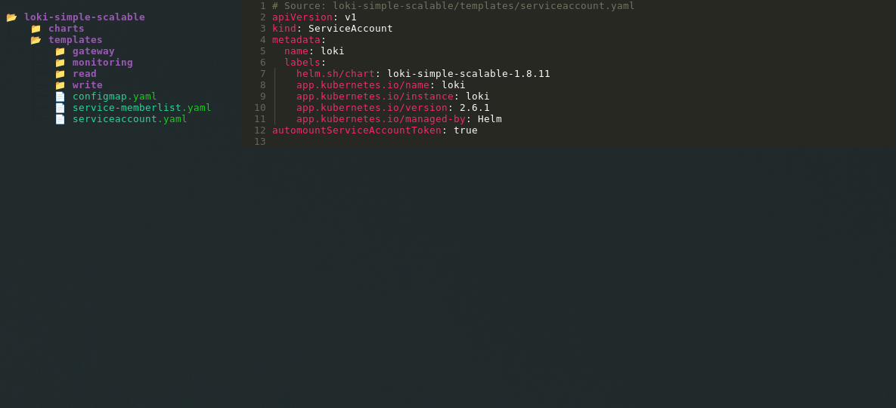

# helm-yaml-tui

A TUI navigator for rendered Helm YAML output with tree navigation and syntax highlighting.

Built with [Textual](https://github.com/Textualize/textual).

## Getting Started

### Installation

The easiest way to use `helm-yaml-tui` is through [pipx](https://pypa.github.io/pipx/),
which will create a clean environment for our installation and its dependencies:

```
$ pipx install helm-yaml-tui
```

Afterwards, you can execute `helm-yaml-tui` directly in your terminal.

Instead of installing with `pipx install`, you can also use `pipx run helm-yaml-tui`
whenever you want to execute `helm-yaml-tui` (see example below).

### Usage

`helm-yaml-tui` can directly consume the output from `helm template`:

[](https://asciinema.org/a/bHAfsPFXsCakImZdmxQLlE06q)


The user interface of `helm-yaml-tui` consists of two major components:
a tree navigator on the left side and a file viewer with syntax highlighting on the right.



The file tree mirrors the structure of the Helm chart used to generate the rendered YAML
piped into `helm-yaml-tui`. You can use your mouse to open/close folders and select YAML
to view them in the file viewer panel.

You can leave `helm-yaml-tui` by pressing `q` (or `Ctrl-C`) on your keyboard.
